# 认识微服务


## 单体架构

单体架构（monolithic structure）：顾名思义，整个项目中所有功能模块都在一个工程中开发；项目部署时需要对所有模块一起编译、打包；项目的架构设计、开发模式都非常简单。


缺点：

- **团队协作成本高**：试想一下，你们团队数十个人同时协作开发同一个项目，由于所有模块都在一个项目中，不同模块的代码之间物理边界越来越模糊。最终要把功能合并到一个分支，你绝对会陷入到解决冲突的泥潭之中。
- **系统发布效率低**：任何模块变更都需要发布整个系统，而系统发布过程中需要多个模块之间制约较多，需要对比各种文件，任何一处出现问题都会导致发布失败，往往一次发布需要数十分钟甚至数小时。
- **系统可用性差**：单体架构各个功能模块是作为一个服务部署，相互之间会互相影响，一些热点功能会耗尽系统资源，导致其它服务低可用。


**单体架构的可用性是比较差的，功能之间相互影响比较大**


## 微服务

微服务架构（Microservices Architecture）是一种软件开发和部署的架构风格，其中应用程序被划分为一组小型、独立的服务，每个服务都可以拥有自己的业务逻辑、数据存储和用户界面。每个服务都能够独立部署、扩展、更新和替换，而且可以使用不同的编程语言、框架和技术栈进行开发。


- **单一职责**：一个微服务负责一部分业务功能，并且其核心数据不依赖于其它模块。
- **团队自治**：每个微服务都有自己独立的开发、测试、发布、运维人员，团队人员规模不超过10人
- **服务自治**：每个微服务都独立打包部署，访问自己独立的数据库。并且要做好服务隔离，避免对其它服务产生影响


# 服务注册与发现


## 注册中心原理

在微服务远程调用的过程中，包括两个角色：

- 服务提供者：提供接口供其它微服务访问，比如`item-service`
- 服务消费者：调用其它微服务提供的接口，比如`cart-service`

在大型微服务项目中，服务提供者的数量会非常多，为了管理这些服务就引入了**注册中心**的概念。注册中心、服务提供者、服务消费者三者间关系如下：

流程如下：

- 服务启动时就会注册自己的服务信息（服务名、IP、端口）到注册中心
- 调用者可以从注册中心订阅想要的服务，获取服务对应的实例列表（1个服务可能多实例部署）
- 调用者自己对实例列表负载均衡，挑选一个实例
- 调用者向该实例发起远程调用

当服务提供者的实例宕机或者启动新实例时，调用者如何得知呢？

- 服务提供者会定期向注册中心发送请求，报告自己的健康状态（心跳请求）
- 当注册中心长时间收不到提供者的心跳时，会认为该实例宕机，将其从服务的实例列表中剔除
- 当服务有新实例启动时，会发送注册服务请求，其信息会被记录在注册中心的服务实例列表
- 当注册中心服务列表变更时，会主动通知微服务，更新本地服务列表


## Nacos注册中心

[Nacos官网](https://nacos.io/zh-cn/docs/what-is-nacos.html)

[教程](https://sca.aliyun.com/zh-cn/docs/2021.0.5.0/user-guide/nacos/overview/ )


# OpenFeign


什么是OpenFeign？

OpenFeign是一个用于构建基于HTTP的客户端的Java工具，它是Spring Cloud生态系统的一部分。OpenFeign旨在简化开发人员使用RESTful服务时的客户端编码和与服务之间的通信。


## 基本使用


### 引入依赖

```xml
  <!--openFeign-->
  <dependency>
      <groupId>org.springframework.cloud</groupId>
      <artifactId>spring-cloud-starter-openfeign</artifactId>
  </dependency>
  <!--负载均衡器-->
  <dependency>
      <groupId>org.springframework.cloud</groupId>
      <artifactId>spring-cloud-starter-loadbalancer</artifactId>
  </dependency>
```


### 启用OpenFeign

在服务的启动类加上注解

```java
@SpringBootApplication(exclude = {RedisAutoConfiguration.class})
@MapperScan("com.yl.myojbackenduserservice.mapper")
@EnableFeignClients(basePackages = {"com.yl.myojbackendserviceclient.service"})
public class MyojBackendUserServiceApplication {

    public static void main(String[] args) {
        SpringApplication.run(MyojBackendUserServiceApplication.class, args);
    }

}
```


### 编写OpenFeign客户端

客户端中只需要声明**接口**，无需实现方法

```java
@FeignClient(name = "myoj-backend-user-service",path = "/api/user/inner")
public interface UserFeignClient {
    /**
     * 根据id获取用户
     * @param userId
     * @return
     */
    @GetMapping("/get/id")
    User getById(@RequestParam("userId")  long userId);
}
```


关键信息说明：

- `@FeignClient(name = "myoj-backend-user-service",path = "/api/user/inner")` ：声明服务名称
- `@GetMapping` ：声明请求方式
- `@GetMapping("/get/id")` ：声明请求路径
- `@RequestParam("userId")  long userId` ：声明请求参数


### 使用FeignClient

只需要在对应的业务层代码中注入客户端，直接调用即可


## 连接池

Feign底层发起http请求，依赖于其它的框架。其底层支持的http客户端实现包括：

- HttpURLConnection：默认实现，不支持连接池
- Apache HttpClient ：支持连接池
- OKHttp：支持连接池

因此我们通常会使用带有连接池的客户端来代替默认的HttpURLConnection。

下面是OK Http的使用


### 引入依赖

```xml
<!--OK http 的依赖 -->
<dependency>
  <groupId>io.github.openfeign</groupId>
  <artifactId>feign-okhttp</artifactId>
</dependency>
```


### 开启连接池

```yml
feign:
  okhttp:
    enabled: true # 开启OKHttp功能
```


## 日志

OpenFeign只会在FeignClient所在包的日志级别为**DEBUG**时，才会输出日志。而且其日志级别有4级：

- **NONE**：不记录任何日志信息，这是默认值。
- **BASIC**：仅记录请求的方法，URL以及响应状态码和执行时间
- **HEADERS**：在BASIC的基础上，额外记录了请求和响应的头信息
- **FULL**：记录所有请求和响应的明细，包括头信息、请求体、元数据。

Feign默认的日志级别就是NONE，所以默认我们看不到请求日志。


### 定义日志的级别

配置类如下

```java
import feign.Logger;
import org.springframework.context.annotation.Bean;

public class DefaultFeignConfig {
    @Bean
    public Logger.Level feignLogLevel(){
        return Logger.Level.FULL;
    }
}
```


### 配置

- **局部**生效：在某个`FeignClient`中配置，只对当前`FeignClient`生效

```java
@FeignClient(value = "item-service", configuration = DefaultFeignConfig.class)
```

- **全局**生效：在启动类的`@EnableFeignClients`中配置，针对所有`FeignClient`生效。

```java
@EnableFeignClients(defaultConfiguration = DefaultFeignConfig.class)
```


# 网关路由


什么是网关？

顾明思议，网关就是**网**络的**关**口。数据在网络间传输，从一个网络传输到另一网络时就需要经过网关来做数据的**路由和转发以及数据安全的校验**。

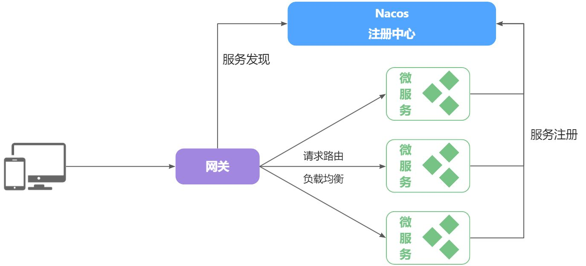


## SpringCloudGateway

以下是使用SpringCloudGateway的重点

**相关依赖**

```xml
<!--网关-->
<dependency>
    <groupId>org.springframework.cloud</groupId>
    <artifactId>spring-cloud-starter-gateway</artifactId>
</dependency>
<!--nacos discovery-->
<dependency>
    <groupId>com.alibaba.cloud</groupId>
    <artifactId>spring-cloud-starter-alibaba-nacos-discovery</artifactId>
</dependency>
<!--负载均衡-->
<dependency>
    <groupId>org.springframework.cloud</groupId>
    <artifactId>spring-cloud-starter-loadbalancer</artifactId>
</dependency>
```


**路由配置**

```yml
spring:
  cloud:
    nacos:
      discovery:
        server-addr: 127.0.0.1:8848 #Nacos Server 的地址
    gateway:
      routes:
        - id: myoj-backend-user-service # 路由规则id，自定义，唯一
          uri: lb://myoj-backend-user-service # 路由的目标服务，lb代表负载均衡，会从注册中心拉取服务列表
          predicates: # 路由断言，判断当前请求是否符合当前规则，符合则路由到目标服务
            - Path=/api/user/**
```


## 网关登录校验

单体架构时只需要完成一次用户登录、身份校验，就可以在所有业务中获取到用户信息。而微服务拆分后，每个微服务都独立部署，不再共享数据。

此时可以把登录校验的工作放到网关去做。


### 网关过滤器

`Gateway`内部工作的基本原理如图：

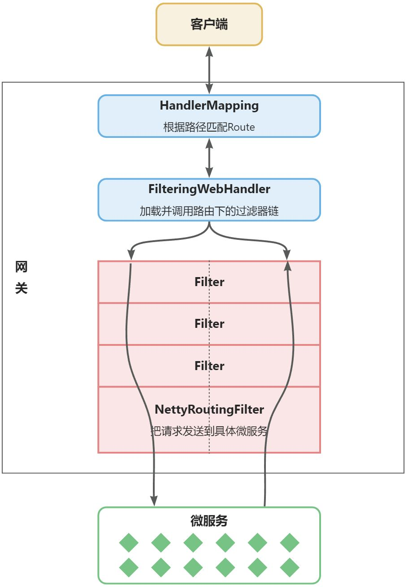

流程：

1. 客户端请求进入网关后由`HandlerMapping`对请求做判断，找到与当前请求匹配的路由规则（**`Route`**），然后将请求交给**`WebHandler`**去处理。
2. `WebHandler`则会加载当前路由下需要执行的过滤器链（**`Filter chain`**），然后按照顺序逐一执行过滤器（后面称为**`Filter`**）。
3. 图中`Filter`被虚线分为左右两部分，是因为`Filter`内部的逻辑分为`pre`和`post`两部分，分别会在请求路由到微服务**之前**和**之后**被执行。
4. 只有所有`Filter`的`pre`逻辑都依次顺序执行通过后，请求才会被路由到微服务。
5. 微服务返回结果后，再倒序执行`Filter`的`post`逻辑。
6. 最终把响应结果返回。


**如果我们能够定义一个过滤器，在其中实现登录校验逻辑，并且将过滤器执行顺序定义到**`NettyRoutingFilter`**之前**，则可以完成鉴权


其中**网关过滤器链**中的过滤器有两种：

- `GatewayFilter`：路由过滤器，作用范围比较灵活，可以是任意指定的路由`Route`. 
- `GlobalFilter`：全局过滤器，作用范围是所有路由，不可配置。

其实`GatewayFilter`和`GlobalFilter`这两种过滤器的方法签名完全一致：

```java
/**
 * 处理请求并将其传递给下一个过滤器
 * @param exchange 当前请求的上下文，其中包含request、response等各种数据
 * @param chain 过滤器链，基于它向下传递请求
 * @return 根据返回值标记当前请求是否被完成或拦截，chain.filter(exchange)就放行了。
 */
Mono<Void> filter(ServerWebExchange exchange, GatewayFilterChain chain);
```

`FilteringWebHandler`在处理请求时，会将`GlobalFilter`装饰为`GatewayFilter`，然后放到同一个过滤器链中，排序以后依次执行。

`Gateway`中内置了很多的`GatewayFilter`，详情可以参考官方文档：

[Spring Cloud Gateway](https://docs.spring.io/spring-cloud-gateway/docs/3.1.7/reference/html/#gatewayfilter-factories)


`Gateway`内置的`GatewayFilter`过滤器使用起来非常简单，无需编码，只要在yaml文件中简单配置即可。而且其作用范围也很灵活，配置在哪个`Route`下，就作用于哪个`Route`.
例如，有一个过滤器叫做`AddRequestHeaderGatewayFilterFacotry`，顾明思议，就是添加请求头的过滤器，可以给请求添加一个请求头并传递到下游微服务。
使用的使用只需要在application.yaml中这样配置：

```yaml
spring:
  cloud:
    gateway:
      routes:
      - id: test_route
        uri: lb://test-service
        predicates:
          -Path=/test/**
        filters:
          - AddRequestHeader=key, value # 逗号之前是请求头的key，逗号之后是value
```

如果想要让过滤器作用于所有的路由，则可以这样配置：

```yaml
spring:
  cloud:
    gateway:
      default-filters: # default-filters下的过滤器可以作用于所有路由
    	- AddRequestHeader=key, value
      routes:
      - id: test_route
        uri: lb://test-service
        predicates:
          -Path=/test/**
```


### 自定义过滤器


自定义GlobalFilter则简单很多，直接实现GlobalFilter即可，而且也无法设置动态参数：

```java
@Component
public class PrintAnyGlobalFilter implements GlobalFilter, Ordered {
    @Override
    public Mono<Void> filter(ServerWebExchange exchange, GatewayFilterChain chain) {
        // 编写过滤器逻辑
        System.out.println("未登录，无法访问");
        // 放行
        // return chain.filter(exchange);

        // 拦截
        ServerHttpResponse response = exchange.getResponse();
        response.setRawStatusCode(401);
        return response.setComplete();
    }

    @Override
    public int getOrder() {
        // 过滤器执行顺序，值越小，优先级越高
        return 0;
    }
}
```


## OpenFeign携带信息


有些复杂的业务，请求到达微服务A后可能还要调用微服务B，微服务C等

为了实现微服务之间的用户信息传递，就**必须在微服务发起调用时把用户信息存入请求头**


借助Feign中提供的一个拦截器接口：`feign.RequestInterceptor`

```java
public interface RequestInterceptor {

  /**
   * Called for every request. 
   * Add data using methods on the supplied {@link RequestTemplate}.
   */
  void apply(RequestTemplate template);
}
```

只需要实现这个接口，然后实现apply方法，利用`RequestTemplate`类来添加请求头，将用户信息保存到请求头中

示例如下：


```java
@Configuration
public class DefaultFeignConfig{
    @Bean
    public RequestInterceptor userInfoRequestInterceptor(){
        return new RequestInterceptor() {
            @Override
            public void apply(RequestTemplate template) {
                // 获取登录用户
                Long userId = UserContext.getUser();
                if(userId == null) {
                    // 如果为空则直接跳过
                    return;
                }
                // 如果不为空则放入请求头中，传递给下游微服务
                template.header("user-info", userId.toString());
            }
        };
    }
}
```

好了，现在微服务之间通过OpenFeign调用时也会传递登录用户信息了


# 配置管理


**配置管理器服务**的出现是为了解决如下问题：

- 网关路由在配置文件中写死了，如果变更必须重启微服务
- 某些业务配置在配置文件中写死了，每次修改都要重启服务
- 每个微服务都有很多重复的配置，维护成本高


Nacos不仅仅具备注册中心功能，也具备配置管理的功能

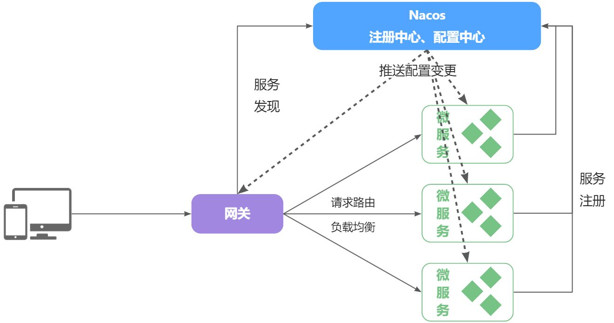

## 配置共享

把微服务共享的配置抽取到Nacos中统一管理，这样就不需要每个微服务都重复配置了

1. 在Nacos中添加共享配置

2. 在Nacos中拉取共享配置


### 添加配置共享

寻找哪些配置是重复的

比如与JDBC相关的配置：

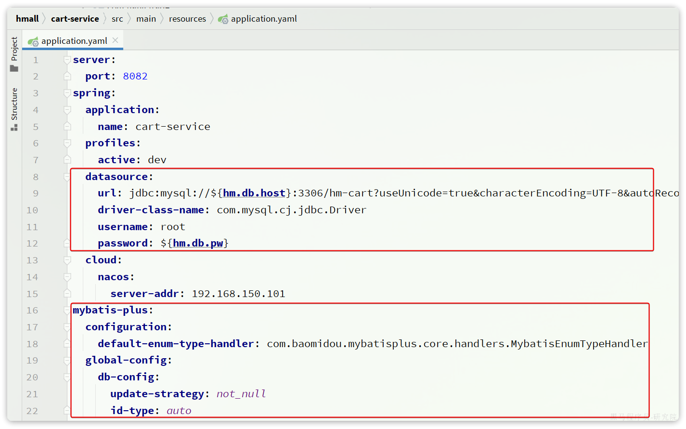

然后是日志配置：
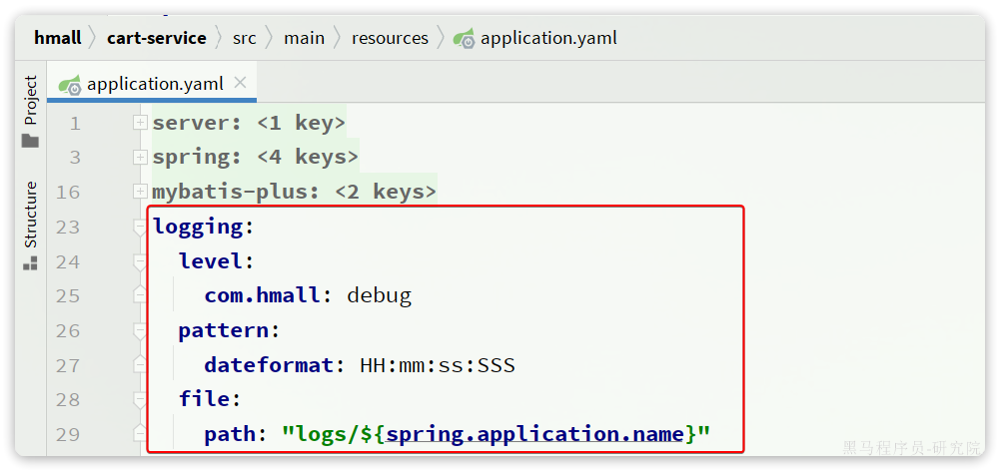
然后是swagger以及OpenFeign的配置：
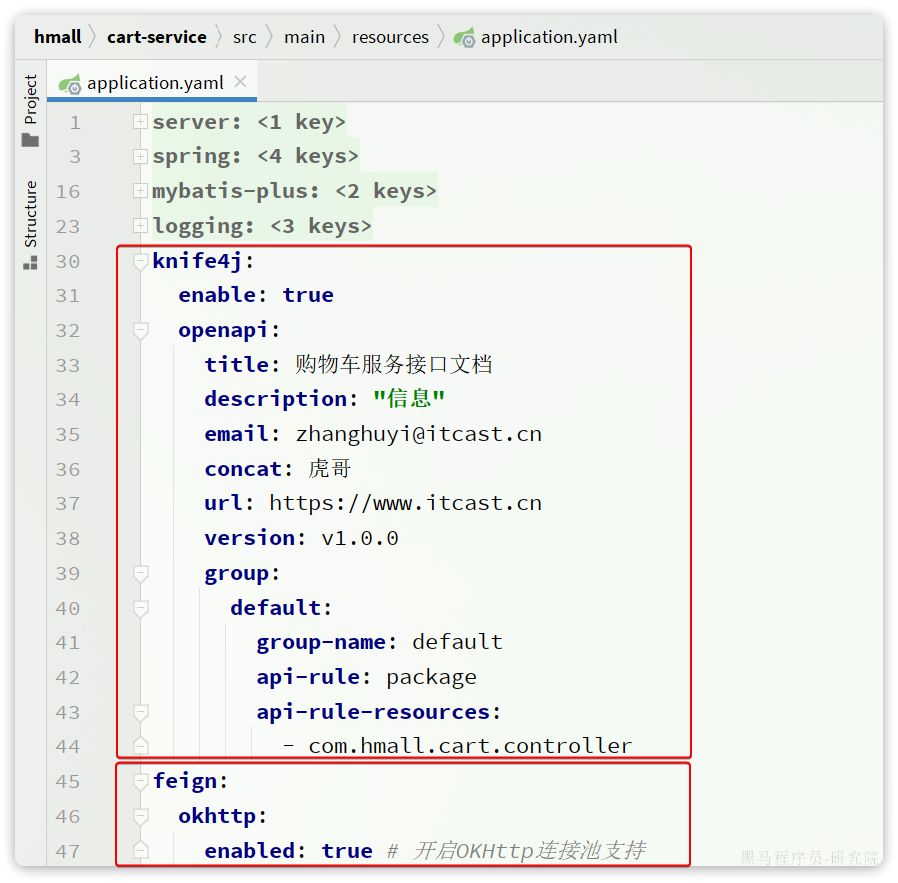

我们在nacos控制台分别添加这些配置。
首先是jdbc相关配置，在`配置管理`->`配置列表`中点击`+`新建一个配置：
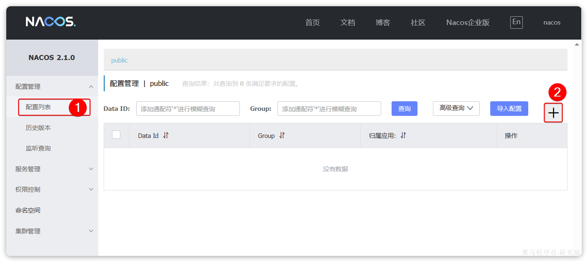
在弹出的表单中填写信息：
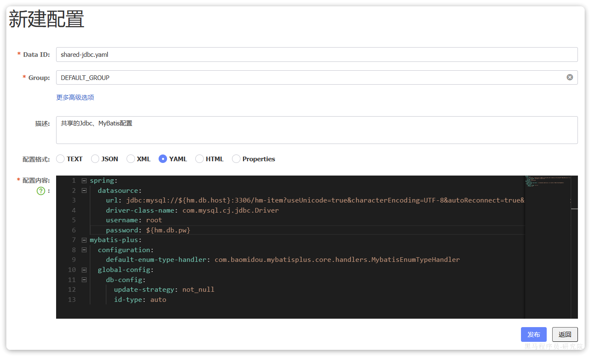
其中详细的配置如下：

```yaml
spring:
  datasource:
    url: jdbc:mysql://${hm.db.host:192.168.150.101}:${hm.db.port:3306}/${hm.db.database}?useUnicode=true&characterEncoding=UTF-8&autoReconnect=true&serverTimezone=Asia/Shanghai
    driver-class-name: com.mysql.cj.jdbc.Driver
    username: ${hm.db.un:root}
    password: ${hm.db.pw:123}
mybatis-plus:
  configuration:
    default-enum-type-handler: com.baomidou.mybatisplus.core.handlers.MybatisEnumTypeHandler
  global-config:
    db-config:
      update-strategy: not_null
      id-type: auto
```

注意这里的jdbc的相关参数并没有写死，例如：

- `数据库ip`：通过`${hm.db.host:192.168.150.101}`配置了默认值为`192.168.150.101`，同时允许通过`${hm.db.host}`来覆盖默认值
- `数据库端口`：通过`${hm.db.port:3306}`配置了默认值为`3306`，同时允许通过`${hm.db.port}`来覆盖默认值
- `数据库database`：可以通过`${hm.db.database}`来设定，无默认值


然后是统一的日志配置，命名为`shared-log.yaml`，配置内容如下：

```yaml
logging:
  level:
    com.hmall: debug
  pattern:
    dateformat: HH:mm:ss:SSS
  file:
    path: "logs/${spring.application.name}"
```

然后是统一的swagger配置，命名为`shared-swagger.yaml`，配置内容如下：

```yaml
knife4j:
  enable: true
  openapi:
    title: ${hm.swagger.title:黑马商城接口文档}
    description: ${hm.swagger.description:黑马商城接口文档}
    email: ${hm.swagger.email:zhanghuyi@itcast.cn}
    concat: ${hm.swagger.concat:虎哥}
    url: https://www.itcast.cn
    version: v1.0.0
    group:
      default:
        group-name: default
        api-rule: package
        api-rule-resources:
          - ${hm.swagger.package}

```

注意，这里的swagger相关配置我们没有写死，例如：

- `title`：接口文档标题，我们用了`${hm.swagger.title}`来代替，将来可以有用户手动指定
- `email`：联系人邮箱，我们用了`${hm.swagger.email:zhanghuyi@itcast.cn}`，默认值是`zhanghuyi@itcast.cn`，同时允许用户利用`${hm.swagger.email}`来覆盖。


### 拉取共享配置

将拉取到的共享配置与本地的`application.yaml`配置合并，完成项目上下文的初始化


不过，需要注意的是，读取Nacos配置是SpringCloud上下文（`ApplicationContext`）初始化时处理的，发生在项目的引导阶段。然后才会初始化SpringBoot上下文，去读取`application.yaml`。

也就是说引导阶段，`application.yaml`文件尚未读取，根本不知道nacos 地址，该如何去加载nacos中的配置文件呢？

SpringCloud在初始化上下文的时候会先读取一个名为`bootstrap.yaml`(或者`bootstrap.properties`)的文件，如果我们将nacos地址配置到`bootstrap.yaml`中，那么在项目引导阶段就可以读取nacos中的配置了。


因此，微服务整合Nacos配置管理的步骤如下：
1）引入依赖：
在cart-service模块引入依赖：

```xml
  <!--nacos配置管理-->
  <dependency>
      <groupId>com.alibaba.cloud</groupId>
      <artifactId>spring-cloud-starter-alibaba-nacos-config</artifactId>
  </dependency>
  <!--读取bootstrap文件-->
  <dependency>
      <groupId>org.springframework.cloud</groupId>
      <artifactId>spring-cloud-starter-bootstrap</artifactId>
  </dependency>
```

2）新建bootstrap.yaml
在cart-service中的resources目录新建一个bootstrap.yaml文件：
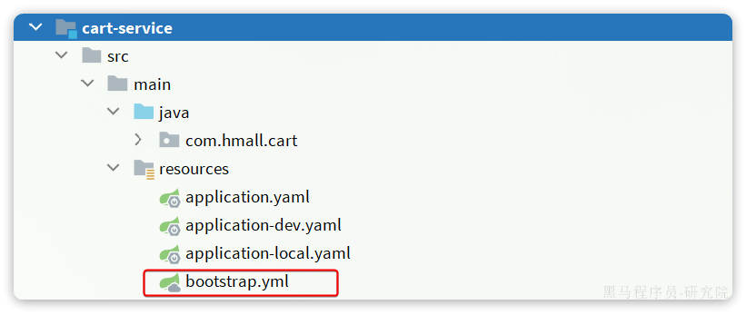
内容如下：

```yaml
spring:
  application:
    name: cart-service # 服务名称
  profiles:
    active: dev
  cloud:
    nacos:
      server-addr: 192.168.150.101 # nacos地址
      config:
        file-extension: yaml # 文件后缀名
        shared-configs: # 共享配置
          - dataId: shared-jdbc.yaml # 共享mybatis配置
          - dataId: shared-log.yaml # 共享日志配置
          - dataId: shared-swagger.yaml # 共享日志配置
```

3）修改application.yaml
由于一些配置挪到了bootstrap.yaml，因此application.yaml需要修改为：

```yaml
server:
  port: 8082
feign:
  okhttp:
    enabled: true # 开启OKHttp连接池支持
hm:
  swagger:
    title: 购物车服务接口文档
    package: com.hmall.cart.controller
  db:
    database: hm-cart

```

重启服务，发现所有配置都生效了


## 配置热更新


有很多的业务相关参数，将来可能会根据实际情况临时调整

为了修改配置后可以不重启服务，需要用到Nacos的配置热更新能力


### 添加配置到Nacos

首先，我们在nacos中添加一个配置文件，将购物车的上限数量添加到配置中：
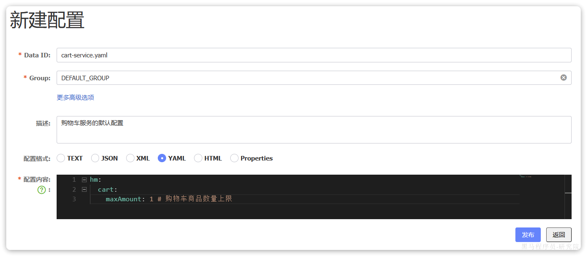
注意文件的dataId格式：

```yaml
[服务名]-[spring.active.profile].[后缀名]
```

文件名称有三部分组成：

- `**服务名**`：我们是购物车服务，所以是`cart-service`
- `**spring.active.profile**`：就是spring boot中的`spring.active.profile`，可以省略，则所有profile共享该配置
- `**后缀名**`：例如yaml

这里我们直接使用`cart-service.yaml`这个名称，则不管是dev还是local环境都可以共享该配置。
配置内容如下：

```yaml
hm:
  cart:
    maxAmount: 1 # 购物车商品数量上限
```

提交配置，在控制台能看到新添加的配置：
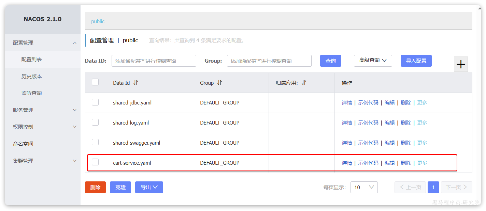

### 配置热更新

接着，我们在微服务中读取配置，实现配置热更新。
在`cart-service`中新建一个属性读取类：
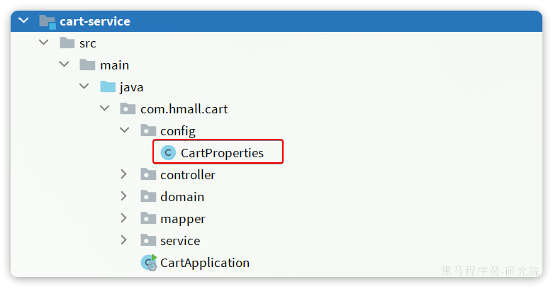
代码如下：

```java
package com.hmall.cart.config;

import lombok.Data;
import org.springframework.boot.context.properties.ConfigurationProperties;
import org.springframework.stereotype.Component;

@Data
@Component
@ConfigurationProperties(prefix = "hm.cart")
public class CartProperties {
    private Integer maxAmount;
}

```

接着，在业务中使用该属性加载类：
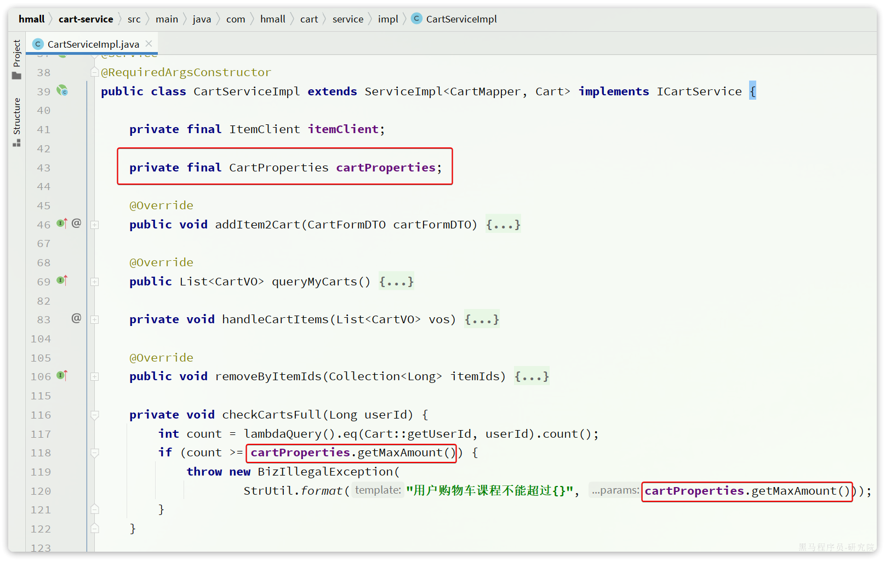

测试，向购物车中添加多个商品：
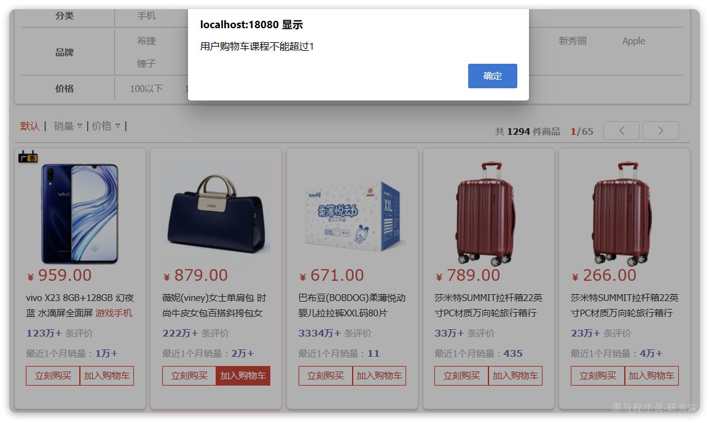
我们在nacos控制台，将购物车上限配置为5：
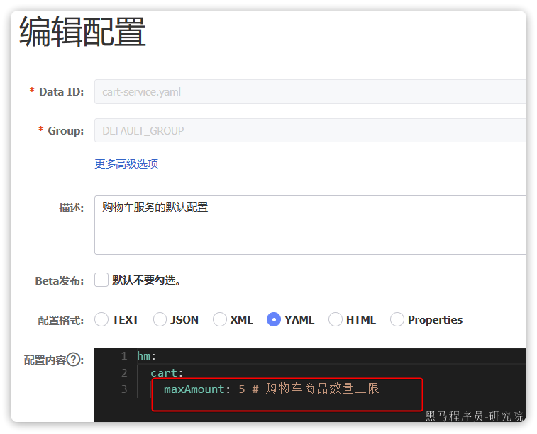

无需重启，再次测试购物车功能：
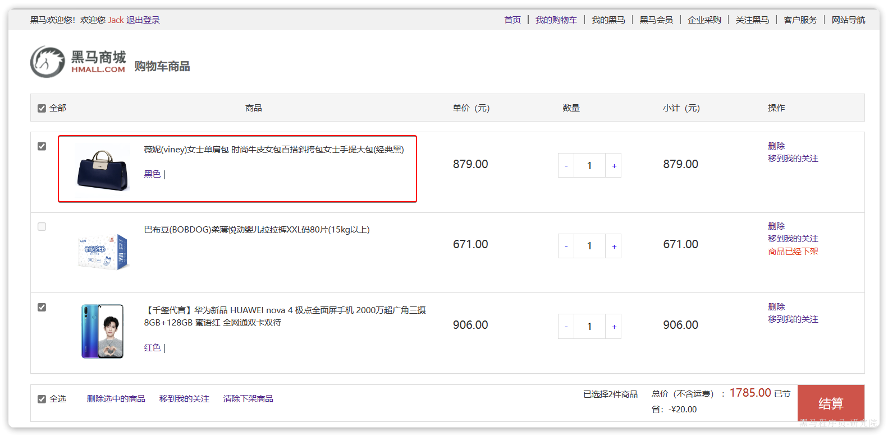
加入成功！
无需重启服务，配置热更新就生效了！


## 动态路由


网关的路由配置全部是在项目启动时由`org.springframework.cloud.gateway.route.CompositeRouteDefinitionLocator`在项目启动的时候加载，并且一经加载就会缓存到内存中的路由表内（一个Map），不会改变。也不会监听路由变更，所以，我们无法利用**配置热更新**来实现路由更新。

因此，我们必须监听Nacos的配置变更，然后手动把最新的路由更新到路由表中。这里有两个难点：

- 如何监听Nacos配置变更？
- 如何把路由信息更新到路由表？


### 监听Nacos配置变更

在Nacos官网中给出了手动监听Nacos配置变更的SDK：
[Java SDK](https://nacos.io/zh-cn/docs/sdk.html)

如果希望 Nacos 推送配置变更，可以使用 Nacos 动态监听配置接口来实现。

```java
public void addListener(String dataId, String group, Listener listener)
```

请求参数说明：

| **参数名** | **参数类型** | **描述**                                                     |
| ---------- | ------------ | ------------------------------------------------------------ |
| dataId     | string       | 配置 ID，保证全局唯一性，只允许英文字符和 4 种特殊字符（"."、":"、"-"、"_"）。不超过 256 字节。 |
| group      | string       | 配置分组，一般是默认的DEFAULT_GROUP。                        |
| listener   | Listener     | 监听器，配置变更进入监听器的回调函数。                       |

示例代码：

```java
String serverAddr = "{serverAddr}";
String dataId = "{dataId}";
String group = "{group}";
// 1.创建ConfigService，连接Nacos
Properties properties = new Properties();
properties.put("serverAddr", serverAddr);
ConfigService configService = NacosFactory.createConfigService(properties);
// 2.读取配置
String content = configService.getConfig(dataId, group, 5000);
// 3.添加配置监听器
configService.addListener(dataId, group, new Listener() {
	@Override
	public void receiveConfigInfo(String configInfo) {
        // 配置变更的通知处理
		System.out.println("recieve1:" + configInfo);
	}
	@Override
	public Executor getExecutor() {
		return null;
	}
});
```

这里核心的步骤有2步：

- 创建ConfigService，目的是连接到Nacos
- 添加配置监听器，编写配置变更的通知处理逻辑

由于采用了`spring-cloud-starter-alibaba-nacos-config`自动装配，因此`ConfigService`已经在`com.alibaba.cloud.nacos.NacosConfigAutoConfiguration`中自动创建好了：
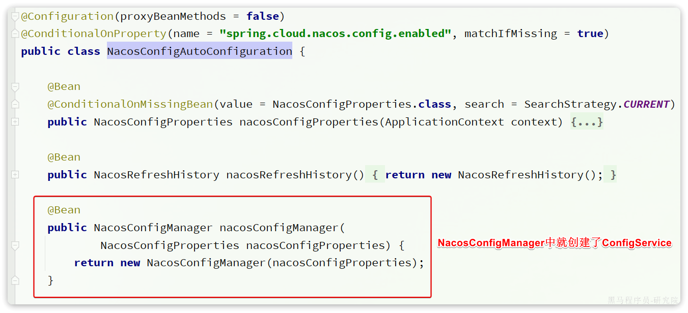
NacosConfigManager中是负责管理Nacos的ConfigService的，具体代码如下：
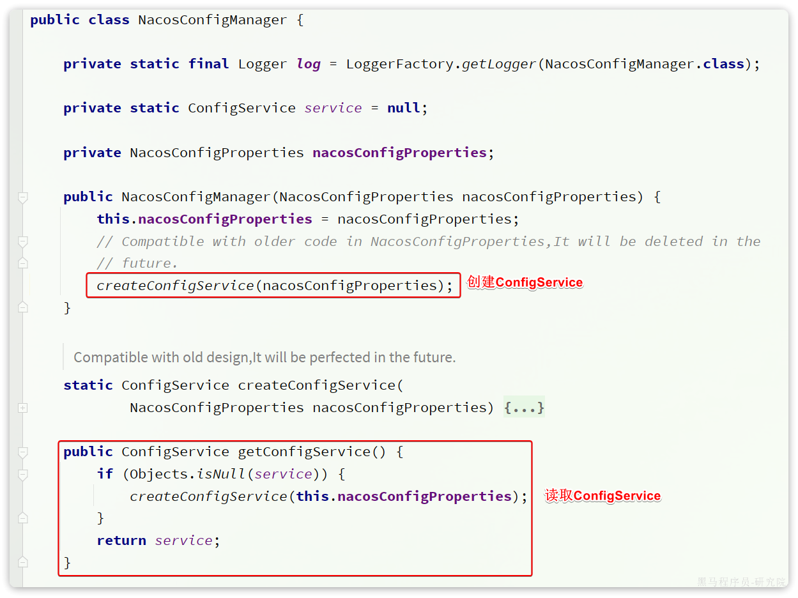

因此，只要我们拿到`NacosConfigManager`就等于拿到了`ConfigService`，第一步就实现了。


第二步，编写监听器。虽然官方提供的SDK是ConfigService中的addListener，不过项目第一次启动时不仅仅需要添加监听器，也需要读取配置，因此建议使用的API是这个：

```java
String getConfigAndSignListener(
    String dataId, // 配置文件id
    String group, // 配置组，走默认
    long timeoutMs, // 读取配置的超时时间
    Listener listener // 监听器
) throws NacosException;
```

既可以配置监听器，并且会根据dataId和group读取配置并返回。我们就可以在项目启动时先更新一次路由，后续随着配置变更通知到监听器，完成路由更新。


### 更新路由

更新路由要用到`org.springframework.cloud.gateway.route.RouteDefinitionWriter`这个接口：

```java
package org.springframework.cloud.gateway.route;

import reactor.core.publisher.Mono;

/**
 * @author Spencer Gibb
 */
public interface RouteDefinitionWriter {
	/**
     * 更新路由到路由表，如果路由id重复，则会覆盖旧的路由
     */
	Mono<Void> save(Mono<RouteDefinition> route);
	/**
     * 根据路由id删除某个路由
     */
	Mono<Void> delete(Mono<String> routeId);

}

```

这里更新的路由，也就是RouteDefinition，包含下列常见字段：

- id：路由id
- predicates：路由匹配规则
- filters：路由过滤器
- uri：路由目的地

将来保存到Nacos的配置也要符合这个对象结构，将来我们以JSON来保存，格式如下：

```json
{
  "id": "item",
  "predicates": [{
    "name": "Path",
    "args": {"_genkey_0":"/items/**", "_genkey_1":"/search/**"}
  }],
  "filters": [],
  "uri": "lb://item-service"
}
```

以上JSON配置就等同于：

```yaml
spring:
  cloud:
    gateway:
      routes:
        - id: item
          uri: lb://item-service
          predicates:
            - Path=/items/**,/search/**
```

OK，我们所需要用到的SDK已经齐全了。


### 实现动态路由

首先， 我们在网关gateway引入依赖：

```xml
    <!--统一配置管理-->
    <dependency>
        <groupId>com.alibaba.cloud</groupId>
        <artifactId>spring-cloud-starter-alibaba-nacos-config</artifactId>
    </dependency>
    <!--加载bootstrap-->
    <dependency>
        <groupId>org.springframework.cloud</groupId>
        <artifactId>spring-cloud-starter-bootstrap</artifactId>
    </dependency>
```

然后在网关`gateway`的`resources`目录创建`bootstrap.yaml`文件，内容如下：

```yaml
spring:
  application:
    name: gateway
  cloud:
    nacos:
      server-addr: 192.168.150.101 #nacos地址
      config:
        file-extension: yaml
        shared-configs:
          - dataId: shared-log.yaml # 共享日志配置
```

接着，修改`gateway`的`resources`目录下的`application.yml`，把之前的路由移除，最终内容如下：

```yaml
server:
  port: 8080 # 端口
hm:
  jwt:
    location: classpath:hmall.jks # 秘钥地址
    alias: hmall # 秘钥别名
    password: hmall123 # 秘钥文件密码
    tokenTTL: 30m # 登录有效期
  auth:
    excludePaths: # 无需登录校验的路径
      - /search/**
      - /users/login
      - /items/**
```

然后，在`gateway`中定义配置监听器：
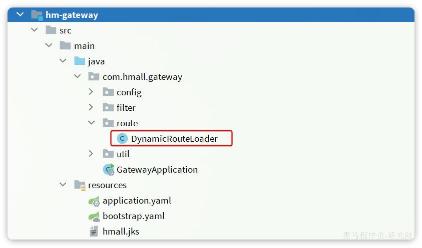
其代码如下：

```java
package com.hmall.gateway.route;

import cn.hutool.json.JSONUtil;
import com.alibaba.cloud.nacos.NacosConfigManager;
import com.alibaba.nacos.api.config.listener.Listener;
import com.alibaba.nacos.api.exception.NacosException;
import com.hmall.common.utils.CollUtils;
import lombok.RequiredArgsConstructor;
import lombok.extern.slf4j.Slf4j;
import org.springframework.cloud.gateway.route.RouteDefinition;
import org.springframework.cloud.gateway.route.RouteDefinitionWriter;
import org.springframework.stereotype.Component;
import reactor.core.publisher.Mono;

import javax.annotation.PostConstruct;
import java.util.HashSet;
import java.util.List;
import java.util.Set;
import java.util.concurrent.Executor;

@Slf4j
@Component
@RequiredArgsConstructor
public class DynamicRouteLoader {

    private final RouteDefinitionWriter writer;
    private final NacosConfigManager nacosConfigManager;

    // 路由配置文件的id和分组
    private final String dataId = "gateway-routes.json";
    private final String group = "DEFAULT_GROUP";
    // 保存更新过的路由id
    private final Set<String> routeIds = new HashSet<>();

    @PostConstruct
    public void initRouteConfigListener() throws NacosException {
        // 1.注册监听器并首次拉取配置
        String configInfo = nacosConfigManager.getConfigService()
                .getConfigAndSignListener(dataId, group, 5000, new Listener() {
                    @Override
                    public Executor getExecutor() {
                        return null;
                    }

                    @Override
                    public void receiveConfigInfo(String configInfo) {
                        updateConfigInfo(configInfo);
                    }
                });
        // 2.首次启动时，更新一次配置
        updateConfigInfo(configInfo);
    }

    private void updateConfigInfo(String configInfo) {
        log.debug("监听到路由配置变更，{}", configInfo);
        // 1.反序列化
        List<RouteDefinition> routeDefinitions = JSONUtil.toList(configInfo, RouteDefinition.class);
        // 2.更新前先清空旧路由
        // 2.1.清除旧路由
        for (String routeId : routeIds) {
            writer.delete(Mono.just(routeId)).subscribe();
        }
        routeIds.clear();
        // 2.2.判断是否有新的路由要更新
        if (CollUtils.isEmpty(routeDefinitions)) {
            // 无新路由配置，直接结束
            return;
        }
        // 3.更新路由
        routeDefinitions.forEach(routeDefinition -> {
            // 3.1.更新路由
            writer.save(Mono.just(routeDefinition)).subscribe();
            // 3.2.记录路由id，方便将来删除
            routeIds.add(routeDefinition.getId());
        });
    }
}

```

重启网关，任意访问一个接口，比如 [http://localhost:8080/search/list?pageNo=1&pageSize=1](http://localhost:8080/search/list?pageNo=1&pageSize=1)：
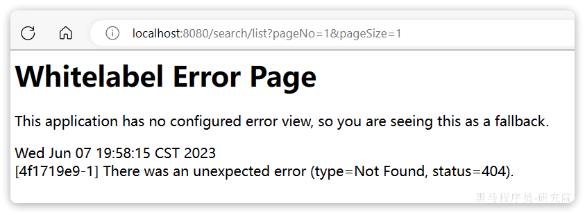
发现是404，无法访问。

接下来，我们直接在Nacos控制台添加路由，路由文件名为`gateway-routes.json`，类型为`json`：
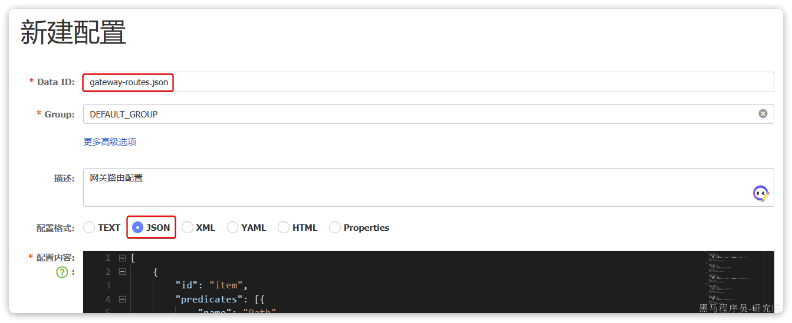
配置内容如下：

```json
[
    {
        "id": "item",
        "predicates": [{
            "name": "Path",
            "args": {"_genkey_0":"/items/**", "_genkey_1":"/search/**"}
        }],
        "filters": [],
        "uri": "lb://item-service"
    },
    {
        "id": "cart",
        "predicates": [{
            "name": "Path",
            "args": {"_genkey_0":"/carts/**"}
        }],
        "filters": [],
        "uri": "lb://cart-service"
    },
    {
        "id": "user",
        "predicates": [{
            "name": "Path",
            "args": {"_genkey_0":"/users/**", "_genkey_1":"/addresses/**"}
        }],
        "filters": [],
        "uri": "lb://user-service"
    },
    {
        "id": "trade",
        "predicates": [{
            "name": "Path",
            "args": {"_genkey_0":"/orders/**"}
        }],
        "filters": [],
        "uri": "lb://trade-service"
    },
    {
        "id": "pay",
        "predicates": [{
            "name": "Path",
            "args": {"_genkey_0":"/pay-orders/**"}
        }],
        "filters": [],
        "uri": "lb://pau-service"
    }
]
```

无需重启网关，稍等几秒钟后，再次访问刚才的地址：
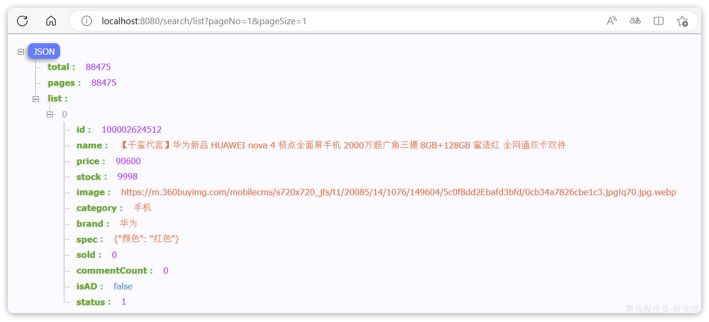

网关路由成功了！！！


# 微服务保护


什么是微服务保护？

保证服务运行的健壮性，避免级联失败导致的雪崩问题


## 保护方案


微服务保护的方案有很多，比如：

- 请求限流
- 线程隔离
- 服务熔断

这些方案或多或少都会导致服务的体验上略有下降，比如请求限流，降低了并发上限；线程隔离，降低了可用资源数量；服务熔断，降低了服务的完整度，部分服务变的不可用或弱可用。

因此这些方案都属于服务**降级**的方案。但通过这些方案，服务的健壮性得到了提升


### 请求限流

请求限流，就是**限制或控制**接口访问的并发流量，避免服务因流量激增而出现故障

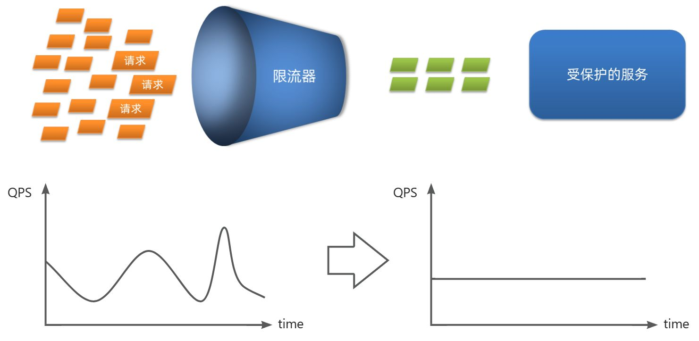


### 线程隔离

当一个业务接口响应时间长，而且并发高时，就可能耗尽服务器的线程资源，导致服务内的其它接口收到影响。所以我们必须把这种影响降低，或者缩减影响的范围。线程隔离正是解决这个问题的好办法。


为了避免某个接口故障或压力过大导致整个服务不可用，我们可以限定每个接口可以使用的资源范围，也就是将其“**隔离**”起来。


如图所示，我们给查询购物车业务限定可用线程数量上限为20，这样即便查询购物车的请求因为查询商品服务而出现故障，也不会导致服务器的线程资源被耗尽，不会影响到其它接口。


### 服务熔断


线程隔离虽然避免了雪崩问题，但故障服务（商品服务）依然会拖慢购物车服务（服务调用方）的接口响应速度。而且商品查询的故障依然会导致查询购物车功能出现故障，购物车业务也变的不可用了

所以，我们要做两件事情：

- **编写服务降级逻辑**：就是服务调用失败后的处理逻辑，根据业务场景，可以抛出异常，也可以返回友好提示或默认数据。
- **异常统计和熔断**：统计服务提供方的异常比例，当比例过高表明该接口会影响到其它服务，应该拒绝调用该接口，而是直接走降级逻辑。


## Sentinel

Sentinel是阿里巴巴开源的一款服务保护框架，目前已经加入SpringCloudAlibaba中。官方网站：
[首页 | Sentinel](https://sentinelguard.io/zh-cn/)

Sentinel 的使用可以分为两个部分:

- **核心库**（Jar包）：不依赖任何框架/库，能够运行于 Java 8 及以上的版本的运行时环境，同时对 Dubbo / Spring Cloud 等框架也有较好的支持。在项目中引入依赖即可实现服务限流、隔离、熔断等功能。
- **控制台**（Dashboard）：Dashboard 主要负责管理推送规则、监控、管理机器信息等。


### 控制台的使用

[Sentinel 控制台]([dashboard | Sentinel (sentinelguard.io)](https://sentinelguard.io/zh-cn/docs/dashboard.html))


### 整合微服务

1）引入sentinel依赖

```xml
<!--sentinel-->
<dependency>
    <groupId>com.alibaba.cloud</groupId> 
    <artifactId>spring-cloud-starter-alibaba-sentinel</artifactId>
</dependency>
```

2）配置控制台
修改application.yaml文件，添加下面内容：

```yaml
spring:
  cloud: 
    sentinel:
      transport:
        dashboard: localhost:8090
```

3）访问`cart-service`的任意端点
重启`cart-service`，然后访问查询购物车接口，sentinel的客户端就会将服务访问的信息提交到`sentinel-dashboard`控制台。并展示出统计信息：


点击簇点链路菜单，会看到下面的页面：


所谓簇点链路，就是单机调用链路，是一次请求进入服务后经过的每一个被`Sentinel`监控的资源。默认情况下，`Sentinel`会监控`SpringMVC`的每一个`Endpoint`（接口）。
因此，我们看到`/carts`这个接口路径就是其中一个簇点，我们可以对其进行限流、熔断、隔离等保护措施。

不过，需要注意的是，我们的SpringMVC接口是按照Restful风格设计，因此购物车的查询、删除、修改等接口全部都是`/carts`路径：

默认情况下Sentinel会把路径作为簇点资源的名称，无法区分路径相同但请求方式不同的接口，查询、删除、修改等都被识别为一个簇点资源，这显然是不合适的。

所以我们可以选择打开Sentinel的请求方式前缀，把`请求方式 + 请求路径`作为簇点资源名：
首先，在`cart-service`的`application.yml`中添加下面的配置：

```yaml
spring:
  cloud:
    sentinel:
      transport:
        dashboard: localhost:8090
      http-method-specify: true # 开启请求方式前缀
```

然后，重启服务，通过页面访问购物车的相关接口，可以看到sentinel控制台的簇点链路发生了变化：


## 请求限流

在簇点链路后面点击流控按钮，即可对其做限流配置：

在弹出的菜单中这样填写：

这样就把查询购物车列表这个簇点资源的流量限制在了每秒6个，也就是最大QPS为6.


## 线程隔离


限流可以降低服务器压力，尽量减少因并发流量引起的服务故障的概率，但并不能完全避免服务故障。一旦某个服务出现故障，我们必须隔离对这个服务的调用，避免发生雪崩。

比如，查询购物车的时候需要查询商品，为了避免因商品服务出现故障导致购物车服务级联失败，我们可以把购物车业务中查询商品的部分隔离起来，限制可用的线程资源：

这样，即便商品服务出现故障，最多导致查询购物车业务故障，并且可用的线程资源也被限定在一定范围，不会导致整个购物车服务崩溃。

所以，我们要对查询商品的FeignClient接口做线程隔离。


### OpenFeign整合Sentinel

修改cart-service模块的application.yml文件，开启Feign的sentinel功能：

```yaml
feign:
  sentinel:
    enabled: true # 开启feign对sentinel的支持
```

然后重启cart-service服务，可以看到查询商品的FeignClient自动变成了一个簇点资源：


### 配置线程隔离

接下来，点击查询商品的FeignClient对应的簇点资源后面的流控按钮：

在弹出的表单中填写下面内容：


注意，这里勾选的是并发线程数限制，也就是说这个查询功能最多使用5个线程，而不是5QPS。如果查询商品的接口每秒处理2个请求，则5个线程的实际QPS在10左右，而超出的请求自然会被拒绝。


我们利用Jemeter测试，每秒发送100个请求：

最终测试结果如下：

进入查询购物车的请求每秒大概在100，而在查询商品时却只剩下每秒10左右，符合我们的预期。

此时如果我们通过页面访问购物车的其它接口，例如添加购物车、修改购物车商品数量，发现不受影响：

响应时间非常短，这就证明线程隔离起到了作用，尽管查询购物车这个接口并发很高，但是它能使用的线程资源被限制了，因此不会影响到其它接口。


## 服务熔断

在上面，我们利用线程隔离对查询购物车业务进行隔离，保护了购物车服务的其它接口。由于查询商品的功能耗时较高（我们模拟了500毫秒延时），再加上线程隔离限定了线程数为5，导致接口吞吐能力有限，最终QPS只有10左右。这就导致了几个问题：
第一，超出的QPS上限的请求就只能抛出异常，从而导致购物车的查询失败。但从业务角度来说，即便没有查询到最新的商品信息，购物车也应该展示给用户，用户体验更好。也就是给查询失败设置一个**降级处理**逻辑。
第二，由于查询商品的延迟较高（模拟的500ms），从而导致查询购物车的响应时间也变的很长。这样不仅拖慢了购物车服务，消耗了购物车服务的更多资源，而且用户体验也很差。对于商品服务这种不太健康的接口，我们应该直接停止调用，直接走降级逻辑，避免影响到当前服务。也就是将商品查询接口**熔断**。

### 编写降级逻辑

触发限流或熔断后的请求不一定要直接报错，也可以返回一些默认数据或者友好提示，用户体验会更好。
给FeignClient编写失败后的降级逻辑有两种方式：

- 方式一：FallbackClass，无法对远程调用的异常做处理
- 方式二：FallbackFactory，可以对远程调用的异常做处理，我们一般选择这种方式。

这里我们演示方式二的失败降级处理。
**步骤一**：在hm-api模块中给`ItemClient`定义降级处理类，实现`FallbackFactory`：

代码如下：

```java
package com.hmall.api.client.fallback;

import com.hmall.api.client.ItemClient;
import com.hmall.api.dto.ItemDTO;
import com.hmall.api.dto.OrderDetailDTO;
import com.hmall.common.exception.BizIllegalException;
import com.hmall.common.utils.CollUtils;
import lombok.extern.slf4j.Slf4j;
import org.springframework.cloud.openfeign.FallbackFactory;

import java.util.Collection;
import java.util.List;

@Slf4j
public class ItemClientFallback implements FallbackFactory<ItemClient> {
    @Override
    public ItemClient create(Throwable cause) {
        return new ItemClient() {
            @Override
            public List<ItemDTO> queryItemByIds(Collection<Long> ids) {
                log.error("远程调用ItemClient#queryItemByIds方法出现异常，参数：{}", ids, cause);
                // 查询购物车允许失败，查询失败，返回空集合
                return CollUtils.emptyList();
            }

            @Override
            public void deductStock(List<OrderDetailDTO> items) {
                // 库存扣减业务需要触发事务回滚，查询失败，抛出异常
                throw new BizIllegalException(cause);
            }
        };
    }
}

```

**步骤二**：在`hm-api`模块中的`com.hmall.api.config.DefaultFeignConfig`类中将`ItemClientFallback`注册为一个`Bean`：

**步骤三**：在`hm-api`模块中的`ItemClient`接口中使用`ItemClientFallbackFactory`：


重启后，再次测试，发现被限流的请求不再报错，走了降级逻辑：

但是未被限流的请求延时依然很高：

导致最终的平局响应时间较长。


### 服务熔断

查询商品的RT较高（模拟的500ms），从而导致查询购物车的RT也变的很长。这样不仅拖慢了购物车服务，消耗了购物车服务的更多资源，而且用户体验也很差。
对于商品服务这种不太健康的接口，我们应该停止调用，直接走降级逻辑，避免影响到当前服务。也就是将商品查询接口**熔断**。当商品服务接口恢复正常后，再允许调用。这其实就是**断路器**的工作模式了。

Sentinel中的断路器不仅可以统计某个接口的**慢请求比例**，还可以统计**异常请求比例**。当这些比例超出阈值时，就会**熔断**该接口，即拦截访问该接口的一切请求，降级处理；当该接口恢复正常时，再放行对于该接口的请求。
断路器的工作状态切换有一个状态机来控制：

状态机包括三个状态：

- **closed**：关闭状态，断路器放行所有请求，并开始统计异常比例、慢请求比例。超过阈值则切换到open状态
- **open**：打开状态，服务调用被**熔断**，访问被熔断服务的请求会被拒绝，快速失败，直接走降级逻辑。Open状态持续一段时间后会进入half-open状态
- **half-open**：半开状态，放行一次请求，根据执行结果来判断接下来的操作。 
  - 请求成功：则切换到closed状态
  - 请求失败：则切换到open状态

我们可以在控制台通过点击簇点后的**`熔断`**按钮来配置熔断策略：

在弹出的表格中这样填写：

这种是按照慢调用比例来做熔断，上述配置的含义是：

- RT超过200毫秒的请求调用就是慢调用
- 统计最近1000ms内的最少5次请求，如果慢调用比例不低于0.5，则触发熔断
- 熔断持续时长20s

配置完成后，再次利用Jemeter测试，可以发现：

在一开始一段时间是允许访问的，后来触发熔断后，查询商品服务的接口通过QPS直接为0，所有请求都被熔断了。而查询购物车的本身并没有受到影响。
此时整个购物车查询服务的平均RT影响不大：


# 分布式事务

首先我们看看项目中的下单业务整体流程：


由于订单、购物车、商品分别在三个不同的微服务，而每个微服务都有自己独立的数据库，因此下单过程中就会跨多个数据库完成业务。而每个微服务都会执行自己的本地事务：

- 交易服务：下单事务
- 购物车服务：清理购物车事务
- 库存服务：扣减库存事务

整个业务中，各个本地事务是有关联的。因此每个微服务的本地事务，也可以称为**分支事务**。多个有关联的分支事务一起就组成了**全局事务**。我们必须保证整个全局事务同时成功或失败。
我们知道每一个分支事务就是传统的**单体事务**，都可以满足ACID特性，但全局事务跨越多个服务、多个数据库，是否还能满足呢？
我们来做一个测试，先进入购物车页面：

目前有4个购物车，然结算下单，进入订单结算页面：

然后将购物车中某个商品的库存修改为`0`：

然后，提交订单，最终因库存不足导致下单失败：

然后我们去查看购物车列表，发现购物车数据依然被清空了，并未回滚：


事务并未遵循ACID的原则，归其原因就是参与事务的多个子业务在不同的微服务，跨越了不同的数据库。虽然每个单独的业务都能在本地遵循ACID，但是它们互相之间没有感知，不知道有人失败了，无法保证最终结果的统一，也就无法遵循ACID的事务特性了。
这就是分布式事务问题，出现以下情况之一就可能产生分布式事务问题：

- 业务跨多个服务实现
- 业务跨多个数据源实现

接下来这一章我们就一起来研究下如何解决分布式事务问题。

## 认识Seata

解决分布式事务的方案有很多，但实现起来都比较复杂，因此我们一般会使用开源的框架来解决分布式事务问题。在众多的开源分布式事务框架中，功能最完善、使用最多的就是阿里巴巴在2019年开源的Seata了。
[Seata 是什么](https://seata.io/zh-cn/docs/overview/what-is-seata.html)

其实分布式事务产生的一个重要原因，就是参与事务的多个分支事务互相无感知，不知道彼此的执行状态。因此解决分布式事务的思想非常简单：
就是找一个统一的**事务协调者**，与多个分支事务通信，检测每个分支事务的执行状态，保证全局事务下的每一个分支事务同时成功或失败即可。大多数的分布式事务框架都是基于这个理论来实现的。

Seata也不例外，在Seata的事务管理中有三个重要的角色：

-  **TC (Transaction Coordinator) -** **事务协调者：**维护全局和分支事务的状态，协调全局事务提交或回滚。 
-  **TM (Transaction Manager) -** **事务管理器：**定义全局事务的范围、开始全局事务、提交或回滚全局事务。 
-  **RM (Resource Manager) -** **资源管理器：**管理分支事务，与TC交谈以注册分支事务和报告分支事务的状态，并驱动分支事务提交或回滚。 

Seata的工作架构如图所示：


其中，**TM**和**RM**可以理解为Seata的客户端部分，引入到参与事务的微服务依赖中即可。将来**TM**和**RM**就会协助微服务，实现本地分支事务与**TC**之间交互，实现事务的提交或回滚。

而**TC**服务则是事务协调中心，是一个独立的微服务，需要单独部署。

## 部署TC服务

### 准备数据库表

Seata支持多种存储模式，但考虑到持久化的需要，我们一般选择基于数据库存储。执行课前资料提供的`《seata-tc.sql》`，导入数据库表：


```mysql
CREATE DATABASE IF NOT EXISTS `seata` /*!40100 DEFAULT CHARACTER SET utf8mb4 COLLATE utf8mb4_0900_ai_ci */ /*!80016 DEFAULT ENCRYPTION='N' */;
USE `seata`;

------------------------------- The script used when storeMode is 'db' --------------------------------
-- the table to store GlobalSession data
CREATE TABLE IF NOT EXISTS `global_table`
(
    `xid`                       VARCHAR(128) NOT NULL,
    `transaction_id`            BIGINT,
    `status`                    TINYINT      NOT NULL,
    `application_id`            VARCHAR(32),
    `transaction_service_group` VARCHAR(32),
    `transaction_name`          VARCHAR(128),
    `timeout`                   INT,
    `begin_time`                BIGINT,
    `application_data`          VARCHAR(2000),
    `gmt_create`                DATETIME,
    `gmt_modified`              DATETIME,
    PRIMARY KEY (`xid`),
    KEY `idx_status_gmt_modified` (`status` , `gmt_modified`),
    KEY `idx_transaction_id` (`transaction_id`)
) ENGINE = InnoDB
  DEFAULT CHARSET = utf8mb4;

-- the table to store BranchSession data
CREATE TABLE IF NOT EXISTS `branch_table`
(
    `branch_id`         BIGINT       NOT NULL,
    `xid`               VARCHAR(128) NOT NULL,
    `transaction_id`    BIGINT,
    `resource_group_id` VARCHAR(32),
    `resource_id`       VARCHAR(256),
    `branch_type`       VARCHAR(8),
    `status`            TINYINT,
    `client_id`         VARCHAR(64),
    `application_data`  VARCHAR(2000),
    `gmt_create`        DATETIME(6),
    `gmt_modified`      DATETIME(6),
    PRIMARY KEY (`branch_id`),
    KEY `idx_xid` (`xid`)
) ENGINE = InnoDB
  DEFAULT CHARSET = utf8mb4;

-- the table to store lock data
CREATE TABLE IF NOT EXISTS `lock_table`
(
    `row_key`        VARCHAR(128) NOT NULL,
    `xid`            VARCHAR(128),
    `transaction_id` BIGINT,
    `branch_id`      BIGINT       NOT NULL,
    `resource_id`    VARCHAR(256),
    `table_name`     VARCHAR(32),
    `pk`             VARCHAR(36),
    `status`         TINYINT      NOT NULL DEFAULT '0' COMMENT '0:locked ,1:rollbacking',
    `gmt_create`     DATETIME,
    `gmt_modified`   DATETIME,
    PRIMARY KEY (`row_key`),
    KEY `idx_status` (`status`),
    KEY `idx_branch_id` (`branch_id`),
    KEY `idx_xid_and_branch_id` (`xid` , `branch_id`)
) ENGINE = InnoDB
  DEFAULT CHARSET = utf8mb4;

CREATE TABLE IF NOT EXISTS `distributed_lock`
(
    `lock_key`       CHAR(20) NOT NULL,
    `lock_value`     VARCHAR(20) NOT NULL,
    `expire`         BIGINT,
    primary key (`lock_key`)
) ENGINE = InnoDB
  DEFAULT CHARSET = utf8mb4;

INSERT INTO `distributed_lock` (lock_key, lock_value, expire) VALUES ('AsyncCommitting', ' ', 0);
INSERT INTO `distributed_lock` (lock_key, lock_value, expire) VALUES ('RetryCommitting', ' ', 0);
INSERT INTO `distributed_lock` (lock_key, lock_value, expire) VALUES ('RetryRollbacking', ' ', 0);
INSERT INTO `distributed_lock` (lock_key, lock_value, expire) VALUES ('TxTimeoutCheck', ' ', 0);
```


### 准备配置文件

课前资料准备了一个seata目录，其中包含了seata运行时所需要的配置文件：

其中包含中文注释，大家可以自行阅读。
我们将整个seata文件夹拷贝到虚拟机的`/root`目录：


### Docker部署

在虚拟机的`/root`目录执行下面的命令：

```shell
docker run --name seata \
-p 8099:8099 \
-p 7099:7099 \
-e SEATA_IP=192.168.150.101 \
-v ./seata:/seata-server/resources \
--privileged=true \
--network hmall \
-d \
seataio/seata-server:1.5.2
```


## 微服务集成Seata

参与分布式事务的每一个微服务都需要集成Seata，我们以`trade-service`为例。

### 引入依赖

为了方便各个微服务集成seata，我们需要把seata配置共享到nacos，因此`trade-service`模块不仅仅要引入seata依赖，还要引入nacos依赖:

```xml
<!--统一配置管理-->
  <dependency>
      <groupId>com.alibaba.cloud</groupId>
      <artifactId>spring-cloud-starter-alibaba-nacos-config</artifactId>
  </dependency>
  <!--读取bootstrap文件-->
  <dependency>
      <groupId>org.springframework.cloud</groupId>
      <artifactId>spring-cloud-starter-bootstrap</artifactId>
  </dependency>
  <!--seata-->
  <dependency>
      <groupId>com.alibaba.cloud</groupId>
      <artifactId>spring-cloud-starter-alibaba-seata</artifactId>
  </dependency>
  <!--sentinel-->
  <dependency>
      <groupId>com.alibaba.cloud</groupId>
      <artifactId>spring-cloud-starter-alibaba-sentinel</artifactId>
  </dependency>
```

### 改造配置

首先在nacos上添加一个共享的seata配置，命名为`shared-seata.yaml`：


内容如下：

```yaml
seata:
  registry: # TC服务注册中心的配置，微服务根据这些信息去注册中心获取tc服务地址
    type: nacos # 注册中心类型 nacos
    nacos:
      server-addr: 192.168.150.101:8848 # nacos地址
      namespace: "" # namespace，默认为空
      group: DEFAULT_GROUP # 分组，默认是DEFAULT_GROUP
      application: seata-server # seata服务名称
      username: nacos
      password: nacos
  tx-service-group: hmall # 事务组名称
  service:
    vgroup-mapping: # 事务组与tc集群的映射关系
      hmall: "default"
```

然后，改造`trade-service`模块，添加`bootstrap.yaml`：

内容如下:

```yaml
spring:
  application:
    name: trade-service # 服务名称
  profiles:
    active: dev
  cloud:
    nacos:
      server-addr: 192.168.150.101 # nacos地址
      config:
        file-extension: yaml # 文件后缀名
        shared-configs: # 共享配置
          - dataId: shared-jdbc.yaml # 共享mybatis配置
          - dataId: shared-log.yaml # 共享日志配置
          - dataId: shared-swagger.yaml # 共享日志配置
          - dataId: shared-seata.yaml # 共享seata配置
```

可以看到这里加载了共享的seata配置。
然后改造application.yaml文件，内容如下：

```yaml
server:
  port: 8085
feign:
  okhttp:
    enabled: true # 开启OKHttp连接池支持
  sentinel:
    enabled: true # 开启Feign对Sentinel的整合
hm:
  swagger:
    title: 交易服务接口文档
    package: com.hmall.trade.controller
  db:
    database: hm-trade
```

参考上述办法分别改造`hm-cart`和`hm-item`两个微服务模块。

### 添加数据库表

**seata的客户端在解决分布式事务的时候需要记录一些中间数据，保存在数据库中**。因此我们要先准备一个这样的表。
将课前资料的seata-at.sql分别文件导入hm-trade、hm-cart、hm-item三个数据库中：

结果：


```mysql
-- for AT mode you must to init this sql for you business database. the seata server not need it.
CREATE TABLE IF NOT EXISTS `undo_log`
(
    `branch_id`     BIGINT       NOT NULL COMMENT 'branch transaction id',
    `xid`           VARCHAR(128) NOT NULL COMMENT 'global transaction id',
    `context`       VARCHAR(128) NOT NULL COMMENT 'undo_log context,such as serialization',
    `rollback_info` LONGBLOB     NOT NULL COMMENT 'rollback info',
    `log_status`    INT(11)      NOT NULL COMMENT '0:normal status,1:defense status',
    `log_created`   DATETIME(6)  NOT NULL COMMENT 'create datetime',
    `log_modified`  DATETIME(6)  NOT NULL COMMENT 'modify datetime',
    UNIQUE KEY `ux_undo_log` (`xid`, `branch_id`)
) ENGINE = InnoDB
  AUTO_INCREMENT = 1
  DEFAULT CHARSET = utf8mb4 COMMENT ='AT transaction mode undo table';
```

OK，至此为止，微服务整合的工作就完成了。可以参考上述方式对`hm-item`和`hm-cart`模块完成整合改造。

### 测试

接下来就是测试的分布式事务的时候了。
我们找到`trade-service`模块下的`com.hmall.trade.service.impl.OrderServiceImpl`类中的`createOrder`方法，也就是下单业务方法。
将其上的`@Transactional`注解改为Seata提供的`@GlobalTransactional`：

`@GlobalTransactional`注解就是在标记事务的起点，将来TM就会基于这个方法判断全局事务范围，初始化全局事务。

我们重启`trade-service`、`item-service`、`cart-service`三个服务。再次测试，发现分布式事务的问题解决了！

那么，Seata是如何解决分布式事务的呢？

## XA模式

Seata支持四种不同的分布式事务解决方案：

- **XA**
- **TCC**
- **AT**
- **SAGA**


`XA` 规范 是` X/Open` 组织定义的分布式事务处理（DTP，Distributed Transaction Processing）标准，XA`` 规范 描述了全局的`TM`与局部的`RM`之间的接口，几乎所有主流的数据库都对 XA 规范 提供了支持。

### 两阶段提交

A是规范，目前主流数据库都实现了这种规范，实现的原理都是基于两阶段提交。

正常情况： 


异常情况：


一阶段：

- 事务协调者通知每个事物参与者执行本地事务
- 本地事务执行完成后报告事务执行状态给事务协调者，此时事务不提交，继续持有数据库锁

二阶段：

- 事务协调者基于一阶段的报告来判断下一步操作
- 如果一阶段都成功，则通知所有事务参与者，提交事务
- 如果一阶段任意一个参与者失败，则通知所有事务参与者回滚事务

### Seata的XA模型

Seata对原始的XA模式做了简单的封装和改造，以适应自己的事务模型，基本架构如图：

`RM`一阶段的工作：

1. 注册分支事务到`TC`
2. 执行分支业务sql但不提交
3. 报告执行状态到`TC`

`TC`二阶段的工作：

1.  `TC`检测各分支事务执行状态
    1. 如果都成功，通知所有RM提交事务
    2. 如果有失败，通知所有RM回滚事务 

`RM`二阶段的工作：

- 接收`TC`指令，提交或回滚事务


### 优缺点

`XA`模式的优点是什么？

- 事务的强一致性，满足ACID原则
- 常用数据库都支持，实现简单，并且没有代码侵入

`XA`模式的缺点是什么？

- 因为一阶段需要锁定数据库资源，等待二阶段结束才释放，性能较差
- 依赖关系型数据库实现事务


## AT模式

`AT`模式同样是分阶段提交的事务模型，不过缺弥补了`XA`模型中资源锁定周期过长的缺陷。

### Seata的AT模型

基本流程图：

阶段一`RM`的工作：

- 注册分支事务
- 记录undo-log（数据快照）
- 执行业务sql并提交
- 报告事务状态

阶段二提交时`RM`的工作：

- 删除undo-log即可

阶段二回滚时`RM`的工作：

- 根据undo-log恢复数据到更新前

### 流程梳理

我们用一个真实的业务来梳理下AT模式的原理。
比如，现在又一个数据库表，记录用户余额：

| **id** | **money** |
| ------ | --------- |
| 1      | 100       |

其中一个分支业务要执行的SQL为：

```sql
 update tb_account set money = money - 10 where id = 1
```

AT模式下，当前分支事务执行流程如下：
**一阶段**：

1. `TM`发起并注册全局事务到`TC`
2. `TM`调用分支事务
3. 分支事务准备执行业务SQL
4. `RM`拦截业务SQL，根据where条件查询原始数据，形成快照。

```json
{
  "id": 1, "money": 100
}
```

5. `RM`执行业务SQL，提交本地事务，释放数据库锁。此时 money = 90
6. `RM`报告本地事务状态给`TC`

**二阶段**：

1. `TM`通知`TC`事务结束
2. `TC`检查分支事务状态
   1. 如果都成功，则立即删除快照
   2. 如果有分支事务失败，需要回滚。读取快照数据（{"id": 1, "money": 100}），将快照恢复到数据库。此时数据库再次恢复为100

流程图：


### AT与XA的区别

简述`AT`模式与`XA`模式最大的区别是什么？

- `XA`模式一阶段不提交事务，锁定资源；`AT`模式一阶段直接提交，不锁定资源。
- `XA`模式依赖数据库机制实现回滚；`AT`模式利用数据快照实现数据回滚。
- `XA`模式强一致；`AT`模式最终一致

可见，AT模式使用起来更加简单，无业务侵入，性能更好。因此企业90%的分布式事务都可以用AT模式来解决。
